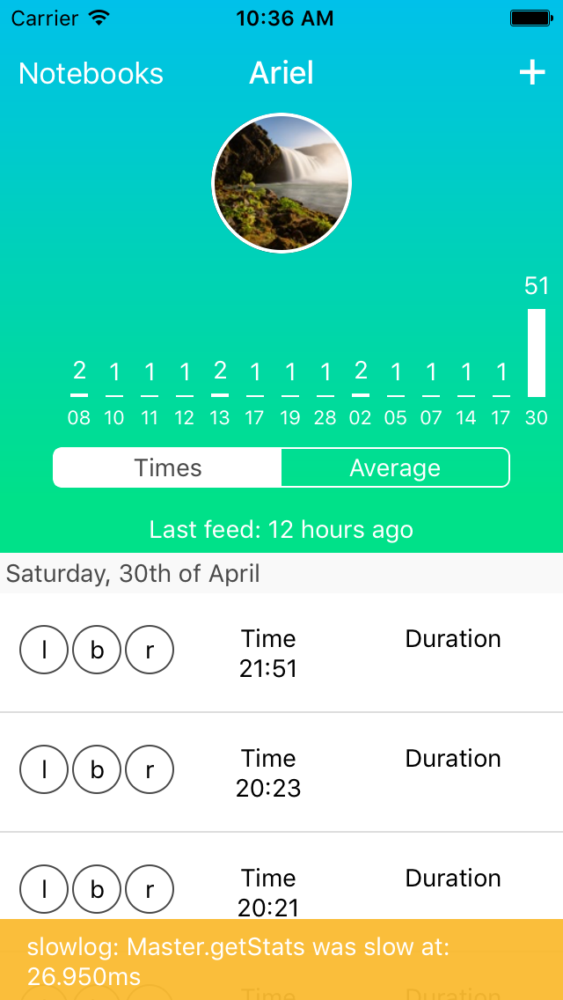

# Slowlog

A high-performance timer for React Native that helps you track big performance problems.
Use it as a first line of defense, before tools like system trace and perftools.



## Quickstart

In your React Native project run:

`$ npm i -S react-native-slowlog`

This is added as a runtime dependency, and `slowlog` will only run in developer mode (using the `__DEV__` flag).

To use `slowlog` apply it to your component this way:

```javascript
class Master extends Component {
  constructor(props){
    super(props)
    slowlog(this, /.*/)

    this.state = this.getDataSource(props)
    this.shouldComponentUpdate = shouldComponentUpdate.bind(this)
  }
...
}
```

## Options

You can apply `slowlog` differently based on your needs:

```javascript
slowlog([this], [regex matching methods], { verbose: false, threshold: 16, log: console, excludes: [dict of excluded methods] })
```

* `verbose` - will output all timing information to console, and just slow operations to yellowbox
* `threshold` - in milliseconds. Anything above that goes to yellowbox
* `log` - a `console`-like object. Anything that responds to `.log([msg])` and `.warn([msg])`
* `excludes` - a dict containing an exclusion list, like so {foobar:true, constructor:true} and so on. If you change this, remember to always
include `constructor`


# Contributing

Fork, implement, add tests, pull request, get my everlasting thanks and a respectable place here :).

# Copyright

Copyright (c) 2016 [Dotan Nahum](http://gplus.to/dotan) [@jondot](http://twitter.com/jondot). See [LICENSE](LICENSE.txt) for further details.


